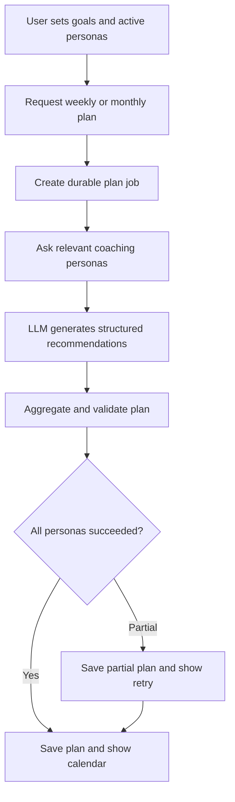

# Goat — core business flow: synchronized training plan

```mermaid
flowchart TD
  A[User sets goals and active personas] --> B[Request weekly or monthly plan]
  B --> C[Create durable plan job]
  C --> D[Ask relevant coaching personas]
  D --> E[LLM generates structured recommendations]
  E --> F[Aggregate and validate plan]
  F --> G{All personas succeeded?}
  G -- Yes --> H[Save plan and show calendar]
  G -- Partial --> I[Save partial plan and show retry]
  I --> H
```

Progress reaches the frontend through SSE; job state remains durable in Postgres.
