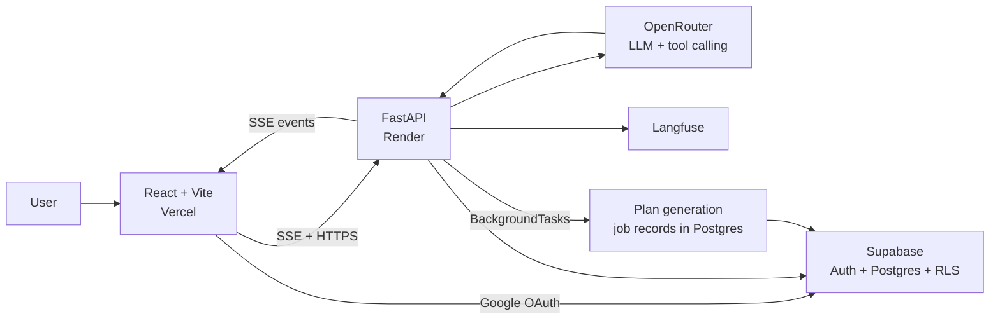

# Goat — current architecture

```mermaid
flowchart LR
  U[User] --> FE[React + Vite\nVercel]
  FE -->|Google OAuth| SB[Supabase\nAuth + Postgres + RLS]
  FE -->|SSE + HTTPS| API[FastAPI\nRender]
  API --> SB
  API --> OR[OpenRouter\nLLM + tool calling]
  API --> LF[Langfuse]
  OR --> API
  API -->|SSE events| FE
  API -->|BackgroundTasks| JOB[Plan generation\njob records in Postgres]
  JOB --> SB
```

The FastAPI backend aggregates provider streaming and tool rounds; plans run in-process with durable Postgres job state, not a separate worker.
