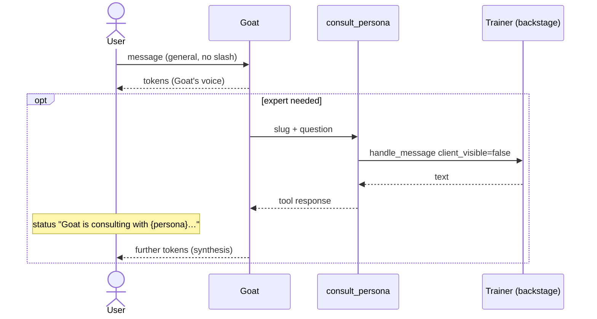

# Design: Goat consults a persona (tool `consult_persona`)

**Date:** 2026-08-16  
**Status:** implemented (2026-08-16)  
**Canon after implementation:** [docs/technical/team-lead.md](../../technical/team-lead.md) · ADR-17 (amendment)

> **Delta relative to** [2026-08-04-team-lead-chat-design.md](./2026-08-04-team-lead-chat-design.md): in `general` session **without `/slug`** Goat is no longer a relayer of trainer quotes. It is the only voice; it consults a specialist with the `consult_persona` tool.

## Problem

The user talks about motor skills, and the dietitian "speaks up" in chat. Cause: `TeamLeadService.plan_consultation` **first picks the speaker**, then that persona's turn (even backstage) lands in the UI as Goat content (`format_goat_relay`). The fallback on LLM error is `ids[0]` (often the dietitian). Feeling: a conversation with the trainer, not with the lead.

## Goal

| Situation | Who speaks to the user |
|-----------|------------------------|
| General conversation, **without** `/slug` | **Goat exclusively** (`persona_id=null`) |
| Goat needs an expert | Tool `consult_persona` — trainer backstage; Goat composes the answer |
| `/slug` / multi-slash | Selected persona directly (unchanged) |
| `persona` session (1:1) | Persona; Goat doesn't participate |
| Plan request | Goat calls `rebuild_plan` in **its own** turn (without a separate trainer loop) |

Status UX (acceptance 2026-08-16): **"Goat is consulting with {persona label}…"**.

## Requirements (Given / When / Then)

### GWT-1 — default voice is Goat

**Given** `session_type=general` session and a message without `/slug`  
**When** the user sends any question (including motor skills, diet, strength)  
**Then** every visible assistant message has `persona_id=null` and label `Goat · Team Lead`  
**And** no bubble with a trainer label appears in the UI (Dietitian / Motor Skills etc.)

### GWT-2 — motor skills doesn't call the dietitian as a speaker

**Given** active personas: dietitian + `motor_coach` (and optionally others)  
**When** the user asks about plyometrics / motor skills / jumping / running (without slash)  
**Then** if Goat consults, `consult_persona` points to `motor_coach` (that persona's slug), **not** the dietitian  
**And** the user still sees only Goat; status: `Goat is consulting with {Motor Skills Trainer}…`

### GWT-3 — consult tool

**Given** Goat's turn in `general` without slash  
**When** the model calls `consult_persona` with the slug of an active persona and `question`  
**Then** the server runs that persona's turn **without** a token stream to the user (`client_visible=false`)  
**And** the result returns as a tool response (trainer text) to Goat  
**And** Goat continues streaming and answers the user in its own voice  
**And** the trainer's answer **is not** saved as a visible `assistant` message in the session

### GWT-4 — bad slug / inactive persona

**Given** Goat calls `consult_persona` with a non-existent or inactive slug  
**When** the server validates arguments  
**Then** tool response is JSON `{ "error": "…" }` (no 500)  
**And** Goat's turn continues

### GWT-5 — slash unchanged

**Given** a message `/motor-skills …` (or another slug of an active persona)  
**When** the turn runs  
**Then** the user sees that persona directly (`persona_id` set)  
**And** `consult_persona` isn't used (Goat doesn't start)

### GWT-6 — roundtable

**Given** the user asks for "let everyone speak" / for a team composition  
**When** Goat answers  
**Then** Goat consults **all** active trainers (consecutive `consult_persona` in the same turn)  
**And** the user gets **one** Goat message (one bubble), not N trainer quotes

### GWT-7 — plan

**Given** "build a plan for August" without merit questions  
**When** Goat has `rebuild_plan`  
**Then** calls `rebuild_plan` and confirms; doesn't have to consult trainers  
**And** when the same message also includes a merit question — it may additionally `consult_persona`

### GWT-8 — trainer doesn't consult

**Given** a persona turn (slash or 1:1 session or nested consult)  
**When** the model tries `consult_persona`  
**Then** the tool isn't in the trainer's schema; if it's called anyway — `{ "error": "…" }`

## Architecture



One SSE turn: `persona_turn_start` **only** for Goat (`persona_id: null`). A nested trainer **doesn't** emit `persona_turn_start` / `token` on the user queue.

### Components

| Unit | Responsibility | Dependencies |
|------|----------------|--------------|
| `consult_persona` schema | OpenRouter function: `slug`, `question` | `tools.py` |
| `ChatOrchestrator._run_single_tool` | Slug validation → active persona; run backstage | `handle_message` with `client_visible=false`, **separate** queue (discard) or flag `emit_sse=false` |
| `run_chat_turn` (`general`, without slash) | **Only** `TeamLeadSpeaker` — no trainer loop, no `format_goat_relay` | `parse_multi_slash_command` stays for slash |
| Goat prompt | Active roster (slug, type, scope from `persona_scope`) + when to consult | `TEAM_LEAD_SYSTEM` replaces the JSON classifier |
| FE status/chip | `consult_persona` → "Goat is consulting with {label}…" / "Consultation" chip | `chat-status.ts`, payload `tool_result.summary` from BE |

### Tool `consult_persona`

```json
{
  "name": "consult_persona",
  "description": "Ask one of the user's active trainers (backstage). Call when you need a detail from THEIR scope. Motor skills/plyometrics/running/jump → motor_coach; diet/macros → dietitian; strength/hypertrophy → personal_trainer. Don't call the wrong role. After the result, answer the user YOURSELF as Goat — don't quote the trainer in full.",
  "parameters": {
    "type": "object",
    "properties": {
      "slug": { "type": "string", "description": "Slug of an active persona from the roster." },
      "question": { "type": "string", "description": "Specific question / brief to the trainer." }
    },
    "required": ["slug", "question"],
    "additionalProperties": false
  }
}
```

**Goat only.** Add to `TEAM_LEAD_CHAT_TOOL_NAMES` / `get_team_lead_plan_tools()`. Don't add to the generic trainer `get_chat_tools()` set (or add to the full list and cut out for trainers — as long as the trainer doesn't have this tool).

**Limit:** max **5** `consult_persona` calls per Goat turn (= max personas per user). Hard counter in `_run_single_tool`; further → error JSON. Preferred: Goat emits N tool_calls in **one** round (the orchestrator runs them sequentially anyway). `chat_max_tool_rounds` (4) stays as the LLM round safety catch for Goat.

**Recursion:** a nested trainer turn **does not** receive `consult_persona`. No consult-in-consult.

**Consult persistence:** ephemeral. No `insert_assistant_message` with the trainer's `persona_id` to the `general` session (that would show the dietitian in history). Trainer context: system prompt (profile, plan, results) as today; that persona's 1:1 history **is not** required in v1.

**SSE on consult:**

```ts
{ type: "tool_call_start", name: "consult_persona" }
{ type: "persona_status", persona_id: null, persona_label: "Goat · Team Lead",
  phase: "tool", message: "Goat is consulting with Anna · Motor Skills Trainer…", tool_name: "consult_persona" }
{ type: "tool_result", tool_name: "consult_persona", summary: "Consulted: Anna · Motor Skills Trainer", success: true }
```

`persona_id` in these events is always `null` (Goat). The trainer's label is **in the status text**, not as a speaker.

### Slash routing (unchanged)

`parse_multi_slash_command` → persona loop with `client_visible=true`. Multi-slash: sequence of visible persona turns (not Goat). Plan-only + slash: Goat doesn't take over — the user selected personas; `rebuild_plan` is still only Goat's, so in slash a persona can only `upsert_plan_items` / refer back to General conversation (existing ADR-17 trade-off; not extended in this iteration).

### Removals (this iteration)

| REMOVED from `general` without slash path | Why |
|----------------------------------------|-----|
| `TeamLeadService.plan_consultation` as speaker selection | Goat decides with tools itself |
| `format_goat_relay` / `_relay_trainer_response_via_goat` | End to "After consultation with Dietitian I pass on" quotes |
| Trainer loop after classifier | Source of the feeling "dietitian speaks up" |
| "1 active persona = that persona's turn" bypass | Still Goat; can consult the single persona |
| Status `{slug} is analyzing…` | Always "Goat + action" |

Heuristics `user_requests_plan_rebuild` / `user_requests_all_trainers` **stay** as hints in Goat's system prompt (not as speaker selection). `build_plan_only_consultation` — remove from `run_chat_turn` (plan = tool in Goat's turn).

`TeamLeadService.complete_json` — dead on happy path; remove or leave unused only if slash tests still call it. Slash doesn't need consultation LLM — `plan_consultation` today already bypasses LLM on slash. After the change `run_chat_turn` doesn't call `plan_consultation` at all.

## Errors

| Case | Behavior |
|------|----------|
| Bad slug / inactive | tool JSON error, Goat continues |
| Timeout / trainer LLM error | tool JSON error; Goat says it failed to consult, answers at a general level or suggests `/slug` |
| 5 consults limit | tool JSON error |
| `consult_persona` from a trainer | not in schema / error |
| Budget exceeded in nested turn | as today (SSE `error`) — Goat's turn ends with budget error |

## Tests

- Backend: schema — Goat has `consult_persona`, trainer doesn't.
- Backend: `_run_single_tool` — happy path with mock trainer LLM; bad slug; limit 3.
- Backend: `run_chat_turn` general without slash — **zero** `persona_turn_start` with non-null `persona_id`; after motor skills mock Goat calls slug `motor_coach`, not dietitian.
- Backend: slash — trainer `persona_id` as today.
- FE: `toolActionLabel("consult_persona")` + chip; status contains "is consulting with".
- Existing `test_team_lead.py`: drop relay/classifier assertions; keep slash, plan heuristics, `persona_display_label`.

## Out of scope

- Parallel consults (stays as a sequence in tool round).
- Trainer history persistence from consults (v1 ephemeral).
- Changing 1:1 session and persona gallery.
- New LLM model / env change.
- `upsert_plan_items` / `log_result` for Goat — still no; result and plan entry saving remains with the trainer (consult can do them backstage; the trainer's `tool_result` chip **doesn't** leak to UI — only the `consult_persona` chip. If a trainer in a consult saves a result, Goat gets it in the tool response text and can say "we saved it"). Detail: nested `handle_message` doesn't emit `tool_result` on the user queue.

## ADR (ADR-17 amendment)

**Decision change (2026-08-16):** In `general` without slash **there is no speaker classifier**. One `TeamLeadSpeaker` turn with tools `get_plan`, `rebuild_plan`, `update_user_profile`, **`consult_persona`**. Trainers speak to the user only via `/slug` or `persona` session.

**Supersedes:** `format_goat_relay`, `plan_consultation` as turn routing, bypass of one active persona as speaker.

## Documents to update on implementation

- `docs/technical/team-lead.md` — new diagram + tool table
- `docs/technical/ai-pipeline.md` §1a
- `docs/adr/decisions.md` ADR-17
- `docs/technical/architecture.md` §3a (delta)
- `AGENTS.md` — Goat: consult tool, not relay
