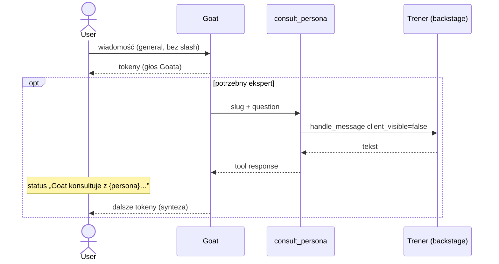

# Design: Goat konsultuje personę (tool `consult_persona`)

**Data:** 2026-08-16  
**Status:** wdrożone (2026-08-16)  
**Kanon po wdrożeniu:** [docs/technical/team-lead.md](../../technical/team-lead.md) · ADR-17 (nowelizacja)

> **Delta względem** [2026-08-04-team-lead-chat-design.md](./2026-08-04-team-lead-chat-design.md): w sesji `general` **bez `/slug`** Goat nie jest już relayerem cytatów trenerów. Jest jedynym głosem; specjalistę dopytuje narzędziem `consult_persona`.

## Problem

User rozmawia o motoryce, a w czacie „odzywa się” dietetyk. Przyczyna: `TeamLeadService.plan_consultation` **najpierw wybiera mówcę**, potem tura tej persony (nawet backstage) ląduje w UI jako treść Goata (`format_goat_relay`). Fallback przy błędzie LLM to `ids[0]` (często dietetyk). Feeling: rozmowa z trenerem, nie z kierownikiem.

## Cel

| Sytuacja | Kto mówi userowi |
|----------|------------------|
| Ogólna rozmowa, **bez** `/slug` | **Wyłącznie Goat** (`persona_id=null`) |
| Goat potrzebuje eksperta | Tool `consult_persona` — trener za kulisami; Goat składa odpowiedź |
| `/slug` / multi-slash | Wybrana persona bezpośrednio (bez zmian) |
| Sesja `persona` (1:1) | Persona; Goat nie uczestniczy |
| Prośba o plan | Goat woła `rebuild_plan` w **swojej** turze (bez osobnej pętli trenerów) |

UX statusu (akceptacja 2026-08-16): **„Goat konsultuje z {etykieta persony}…”**.

## Wymagania (Given / When / Then)

### GWT-1 — domyślny głos to Goat

**Given** sesja `session_type=general` i wiadomość bez `/slug`  
**When** user wysyła dowolne pytanie (w tym motoryka, dieta, siła)  
**Then** każda widoczna wiadomość asystenta ma `persona_id=null` i etykietę `Goat · Kierownik Zespołu`  
**And** w UI nie pojawia się bubble z etykietą trenera (Dietetyk / Motoryka itd.)

### GWT-2 — motoryka nie woła dietetyka jako mówcy

**Given** aktywne persony: dietetyk + `motor_coach` (i opcjonalnie inne)  
**When** user pyta o plyometrię / motorykę / skok / bieganie (bez slashy)  
**Then** jeśli Goat konsultuje, `consult_persona` wskazuje `motor_coach` (slug tej persony), **nie** dietetyka  
**And** user nadal widzi tylko Goata; status: `Goat konsultuje z {Trener motoryczny}…`

### GWT-3 — tool consult

**Given** tura Goata w `general` bez slashy  
**When** model woła `consult_persona` z `slug` aktywnej persony i `question`  
**Then** serwer uruchamia turę tej persony **bez** streamu tokenów do usera (`client_visible=false`)  
**And** wynik wraca jako tool response (tekst trenera) do Goata  
**And** Goat kontynuuje stream i odpowiada userowi swoim głosem  
**And** odpowiedź trenera **nie** jest zapisywana jako widoczna wiadomość `assistant` w sesji

### GWT-4 — zły slug / nieaktywna persona

**Given** Goat woła `consult_persona` z nieistniejącym lub nieaktywnym slugiem  
**When** serwer waliduje argumenty  
**Then** tool response to JSON `{ "error": "…" }` (bez 500)  
**And** tura Goata trwa dalej

### GWT-5 — slash bez zmian

**Given** wiadomość `/motoryka …` (lub inny slug aktywnej persony)  
**When** tura się wykonuje  
**Then** user widzi tę personę bezpośrednio (`persona_id` ustawione)  
**And** `consult_persona` nie jest używane (Goat nie startuje)

### GWT-6 — roundtable

**Given** user prosi „niech każdy” / o skład zespołu  
**When** Goat odpowiada  
**Then** Goat konsultuje **wszystkich** aktywnych trenerów (kolejne `consult_persona` w tej samej turze)  
**And** user dostaje **jedną** wiadomość Goata (jeden bubble), nie N cytatów trenerów

### GWT-7 — plan

**Given** „ułóż plan na sierpień” bez pytań merytorycznych  
**When** Goat ma `rebuild_plan`  
**Then** woła `rebuild_plan` i potwierdza; nie musi konsultować trenerów  
**And** gdy w tej samej wiadomości jest też pytanie merytoryczne — może dodatkowo `consult_persona`

### GWT-8 — trener nie konsultuje

**Given** tura persony (slash lub sesja 1:1 lub zagnieżdżony consult)  
**When** model próbuje `consult_persona`  
**Then** narzędzie nie jest w schemacie trenera; jeśli mimo to wywołane — `{ "error": "…" }`

## Architektura



Jedna tura SSE: `persona_turn_start` **tylko** dla Goata (`persona_id: null`). Zagnieżdżony trener **nie** emituje `persona_turn_start` / `token` na kolejkę usera.

### Komponenty

| Jednostka | Odpowiedzialność | Zależności |
|-----------|------------------|------------|
| `consult_persona` schema | OpenRouter function: `slug`, `question` | `tools.py` |
| `ChatOrchestrator._run_single_tool` | Walidacja slug → aktywna persona; uruchomienie backstage | `handle_message` z `client_visible=false`, **osobna** kolejka (discard) albo flaga `emit_sse=false` |
| `run_chat_turn` (`general`, bez slash) | **Tylko** `TeamLeadSpeaker` — bez pętli trenerów, bez `format_goat_relay` | `parse_multi_slash_command` zostaje dla slash |
| Prompt Goata | Roster aktywnych (slug, typ, zakres z `persona_scope`) + kiedy konsultować | `TEAM_LEAD_SYSTEM` zastępuje klasyfikator JSON |
| FE status/chip | `consult_persona` → „Goat konsultuje z {label}…” / chip „Konsultacja” | `chat-status.ts`, payload `tool_result.summary` z BE |

### Tool `consult_persona`

```json
{
  "name": "consult_persona",
  "description": "Dopytaj jednego aktywnego trenera usera (za kulisami). Wołaj gdy potrzebujesz szczegółu z JEGO zakresu. Motoryka/plyometria/bieganie/skok → motor_coach; dieta/makro → dietitian; siła/hipertrofia → personal_trainer. Nie wołaj złej roli. Po wyniku odpowiedz userowi SAM jako Goat — nie cytuj trenera w całości.",
  "parameters": {
    "type": "object",
    "properties": {
      "slug": { "type": "string", "description": "Slug aktywnej persony z rosteru." },
      "question": { "type": "string", "description": "Konkretne pytanie / brief do trenera." }
    },
    "required": ["slug", "question"],
    "additionalProperties": false
  }
}
```

**Tylko Goat.** Dodać do `TEAM_LEAD_CHAT_TOOL_NAMES` / `get_team_lead_plan_tools()`. Nie dodawać do `get_chat_tools()` ogólnego zestawu trenerów (albo dodać do pełnej listy i wyciąć u trenerów — byle trener nie miał tego toola).

**Limit:** max **5** wywołań `consult_persona` na turę Goata (= max person usera). Twardy licznik w `_run_single_tool`; dalsze → error JSON. Preferowane: Goat emituje N tool_calls w **jednej** rundzie (orchestrator i tak wykonuje je sekwencyjnie). `chat_max_tool_rounds` (4) zostaje jako bezpiecznik rund LLM Goata.

**Rekurencja:** zagnieżdżona tura trenera **nie** dostaje `consult_persona`. Brak consult-in-consult.

**Persistencja consultu:** ephemeral. Nie `insert_assistant_message` z `persona_id` trenera do sesji `general` (to pokazałoby dietetyka w historii). Kontekst trenera: system prompt (profil, plan, wyniki) jak dziś; historia 1:1 tej persony **nie** jest wymagana w v1.

**SSE przy consult:**

```ts
{ type: "tool_call_start", name: "consult_persona" }
{ type: "persona_status", persona_id: null, persona_label: "Goat · Kierownik Zespołu",
  phase: "tool", message: "Goat konsultuje z Anna · Trener motoryczny…", tool_name: "consult_persona" }
{ type: "tool_result", tool_name: "consult_persona", summary: "Skonsultowano: Anna · Trener motoryczny", success: true }
```

`persona_id` w tych eventach zawsze `null` (Goat). Etykieta trenera jest **w tekście statusu**, nie jako mówca.

### Routing slash (bez zmian)

`parse_multi_slash_command` → pętla person z `client_visible=true`. Multi-slash: sekwencja widocznych tur person (nie Goat). Plan-only + slash: Goat nie przejmuje — user wybrał persony; `rebuild_plan` nadal tylko u Goata, więc w slash persona może tylko `upsert_plan_items` / odesłać do Ogólnej rozmowy (istniejący trade-off ADR-17; nie rozszerzamy w tej iteracji).

### Usunięcia (ta iteracja)

| REMOVED z ścieżki `general` bez slash | Powód |
|--------------------------------------|--------|
| `TeamLeadService.plan_consultation` jako wybór mówcy | Goat sam decyduje toolami |
| `format_goat_relay` / `_relay_trainer_response_via_goat` | Koniec cytatów „Po konsultacji z Dietetykiem przekazuję” |
| Pętla trenerów po klasyfikatorze | Źródło feeling „odzywa się dietetyk” |
| Bypass „1 aktywna persona = tura tej persony” | Nadal Goat; może skonsultować jedyną personę |
| Status `{slug} analizuje…` | Zawsze „Goat + akcja” |

Heurystyki `user_requests_plan_rebuild` / `user_requests_all_trainers` **zostają** jako wskazówki w system prompt Goata (nie jako wybór speakerów). `build_plan_only_consultation` — usunąć z `run_chat_turn` (plan = tool w turze Goata).

`TeamLeadService.complete_json` — martwy na happy path; usunąć lub zostawić nieużywany tylko jeśli testy slash nadal go wołają. Slash nie potrzebuje LLM konsultacji — `plan_consultation` dziś już omija LLM przy slash. Po zmianie `run_chat_turn` nie woła `plan_consultation` wcale.

## Błędy

| Przypadek | Zachowanie |
|-----------|------------|
| Zły slug / nieaktywna | tool JSON error, Goat kontynuuje |
| Timeout / błąd LLM trenera | tool JSON error; Goat mówi, że nie udało się skonsultować, odpowiada na poziomie ogólnym albo proponuje `/slug` |
| Limit 5 consultów | tool JSON error |
| `consult_persona` u trenera | brak w schema / error |
| Budget exceeded w zagnieżdżonej turze | jak dziś (`error` SSE) — tura Goata się kończy błędem budżetu |

## Testy

- Backend: schema — Goat ma `consult_persona`, trener nie.
- Backend: `_run_single_tool` — happy path mock LLM trenera; zły slug; limit 3.
- Backend: `run_chat_turn` general bez slash — **zero** `persona_turn_start` z nie-null `persona_id`; po motoryce mock Goat woła slug `motor_coach`, nie dietitian.
- Backend: slash — `persona_id` trenera jak dziś.
- FE: `toolActionLabel("consult_persona")` + chip; status zawiera „konsultuje z”.
- Istniejące `test_team_lead.py`: zdjąć asercje relay/klasyfikatora speakerów; zostawić slash, heurystyki planu, `persona_display_label`.

## Poza zakresem

- Równoległe consulty (zostaje sekwencja w rundzie tooli).
- Persystencja historii trenera z consultów (v1 ephemeral).
- Zmiana sesji 1:1 i galerii person.
- Nowy model LLM / zmiana env.
- `upsert_plan_items` / `log_result` u Goata — nadal nie; zapis wyniku i pozycji planu zostaje u trenera (consult może je wykonać za kulisami; chip tool_result trenera **nie** wycieka do UI — tylko chip `consult_persona`. Jeśli trener w consultcie zapisze wynik, Goat dostaje to w tekście tool response i może powiedzieć „zapisaliśmy”). Szczegół: zagnieżdżony `handle_message` nie emituje `tool_result` na kolejkę usera.

## ADR (nowelizacja ADR-17)

**Zmiana decyzji (2026-08-16):** W `general` bez slashy **nie ma klasyfikatora speakerów**. Jedna tura `TeamLeadSpeaker` z toolami `get_plan`, `rebuild_plan`, `update_user_profile`, **`consult_persona`**. Trenerzy mówią userowi wyłącznie przez `/slug` lub sesję `persona`.

**Supersedes:** `format_goat_relay`, `plan_consultation` jako routing tury, bypass jednej aktywnej persony jako speaker.

## Dokumenty do aktualizacji przy wdrożeniu

- `docs/technical/team-lead.md` — nowy diagram + tabela tooli
- `docs/technical/ai-pipeline.md` §1a
- `docs/adr/decisions.md` ADR-17
- `docs/technical/architecture.md` §3a (delta)
- `AGENTS.md` — Goat: consult tool, nie relay
