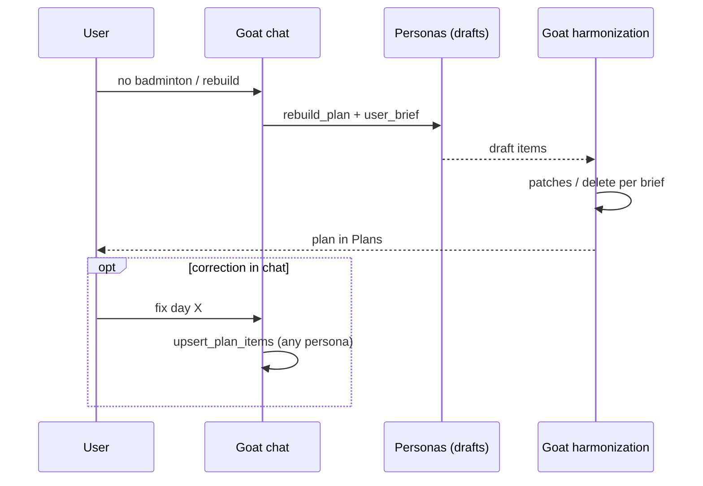

# Design: Goat — final voice over the plan (chat + harmonization)

**Date:** 2026-08-17  
**Status:** accepted / implemented (2026-08-17)  
**Related:** [ADR-17](../../adr/decisions.md#adr-17-kierownik-zespołu-goat--koordynacja-sesji-general), [team-lead.md](../../technical/team-lead.md), [2026-08-16-goat-consult-persona-design.md](./2026-08-16-goat-consult-persona-design.md), ADR-2 (3-stage pipeline)

|> **Delta:** Goat doesn't just trigger `rebuild_plan`. It has the **final voice** over plan content: (1) in chat it can modify entries of any persona, (2) the harmonization stage in Plans is explicitly Goat's role and respects `user_brief`. Personas still generate and can `upsert_plan_items`; Goat can overwrite / cut.

## Problem

In chat, the user agrees on hard constraints with Goat (e.g. zero badminton until September). Goat promises a rebuild. In the Plans tab you can see that **individual personas** (including the badminton trainer) generate their own fragments, and "Plan harmonization…" is an anonymous step — it doesn't look like the Lead's decision. Goat in chat **doesn't** have `upsert_plan_items`, so it can't quickly fix a card without another full generate.

Feeling: "the lead says he'll handle it", yet the UI shows autonomous personas without his control.

## Goal

| Situation | Who has the final voice |
|-----------|-------------------------|
| Plan generation (pipeline) | Personas = drafts; **Goat** = stage 3 (harmonization / patches / cuts per brief) |
| `general` chat | **Goat** can read and **modify** entries of any active persona |
| `/slug` chat or `persona` session | Persona can `upsert_plan_items` (unchanged); Goat doesn't start |
| User brief (e.g. no badminton) | `user_brief` + role exclusion before generation **and** Goat in harmonization enforces brief |

UI: in the job progress a visible row **Goat · Team Lead** (harmonizing / done), instead of just an anonymous pill "Plan harmonization…".

## Requirements (Given / When / Then)

### GWT-1 — Goat upsert in chat

**Given** `general` session, Goat in turn, user's active personas  
**When** Goat calls `upsert_plan_items` with `persona_id` (or slug→id) of an active persona and valid entries  
**Then** that persona's entries are saved / overwritten  
**And** FE shows a chip like for other plan tools (e.g. "Plans")  
**And** optionally a light day harmonization fires (as today after trainer upsert)

### GWT-2 — trainer can still save

**Given** trainer turn (`/slug` or consult backstage)  
**When** the trainer calls `upsert_plan_items` for **their own** `persona_id`  
**Then** save works as today (no permissions to others' personas)

### GWT-3 — harmonization = Goat in UI

**Given** `plan_generate` job after all personas finish generation  
**When** stage 3 starts  
**Then** the progress UI shows Goat's stage: label `Goat · Team Lead`, status like "harmonizing…" → "Done"  
**And** the copy doesn't suggest an anonymous "steward" without the Lead

### GWT-4 — brief enforced in harmonization

**Given** `rebuild_plan` with `user_brief` containing a badminton exclusion (and/or skip `badminton_coach` before generation)  
**When** the job ends in success/partial  
**Then** in the ready plan **there are no** badminton cards on the covered days  
**And** if a persona's draft violated the brief, Goat's patches remove or replace those entries

### GWT-5 — final voice without blocking personas

**Given** a persona saved a fragment, then the user asks Goat in chat for a correction  
**When** Goat does `upsert_plan_items` / rebuild with brief  
**Then** the result in Plans reflects Goat's decision (persona override)

### GWT-6 — no tool regression

**Given** Goat  
**When** tool list  
**Then** has: `get_plan`, `rebuild_plan`, `update_user_profile`, `consult_persona`, **`upsert_plan_items`**  
**And** still **doesn't** have `log_result`  
**And** the trainer still **doesn't** have `rebuild_plan` / `consult_persona`

## Approach (variant 1 — accepted)

### Chat

- Add `upsert_plan_items` to `TEAM_LEAD_CHAT_TOOL_NAMES` / `get_team_lead_plan_tools()`.
- Handler: Goat may point to **any** `persona_id` from the active roster (validation as today's `allowed_persona_ids`).
- Goat's prompt: personas can save drafts; the **final layout** is set by Goat (`upsert` or `rebuild_plan` + brief).
- `consult_persona` still rare (no change from 2026-08-17).

### Pipeline (no change to ADR-2 ordering)

1. Coordinator skeleton (can receive `user_brief` — partially already).
2. Per-persona generate (with brief; skip excluded roles).
3. Harmonization: **prompt and semantics = Goat · Lead** (not "anonymous steward"); input = draft + brief; output = targeted patches (+ optionally delete empty / conflicting entries if schema allows — minimally: patch title/rows on regeneration / rest).

### Frontend Plans

- `PlanGenerationPersonaProgress`: instead of / alongside the "Plan harmonization…" pill — row **Goat · Team Lead** with harmonization phase.  
- Status source: existing job signal (when personas 100% and job still `running` / harmonization flag) or explicit field in job API if needed (prefer without migration: FE heuristic `personas all done && job running` → Goat is harmonizing).

### Out of scope (this iteration)

- Separate "Goat plan items" table / system `persona_id` in DB.
- Variant 2 (Goat-first skeleton as a separate full pass before personas).
- Deactivating the badminton persona in the user profile (brief + skip + harmonization suffice).

## Files (orientation)

| Layer | Files |
|-------|-------|
| Tools / chat orchestrator | `tools.py`, `orchestrator.py`, `team_lead.py` (prompt) |
| Plan pipeline | `plans/orchestrator.py` (`_run_harmonization` prompt + brief) |
| FE | `PlanGenerationPersonaProgress.tsx`, possibly `chat-status.ts` |
| Tests | `test_chat_tools_schema.py`, Goat prompt tests, brief→exclude harmonization unit, FE status |
| Docs | `team-lead.md`, ADR-17 delta, `ai-pipeline.md` § plan |

## Decisions

| Date | Decision | Why |
|------|----------|-----|
| 2026-08-17 | Variant 1 (not Goat-first / not Goat-only writer) | Small diff, ADR-2 stays, personas stay authors of drafts |
| 2026-08-17 | Personas **can** `upsert`; Goat has **final voice** | Product: experts save, lead corrects |
| 2026-08-17 | Harmonization UI = Goat, not anonymous | Feeling "lead handles it" consistent with chat |
| 2026-08-17 | No new migration if FE heuristic + BE prompt suffice | Speed; personas jobs already exist |

## Risks

| Risk | Mitigation |
|------|------------|
| Badminton "flashes" in progress before Goat cuts it | `user_brief` role skip before generate + enforcement in harmonization |
| Goat upserts a wrong persona | Hard `allowed_persona_ids` / roster validation |
| Patches schema can't "delete" | Patch on rest/empty + possibly extending schema with `action: delete` in this iteration if tests require |
