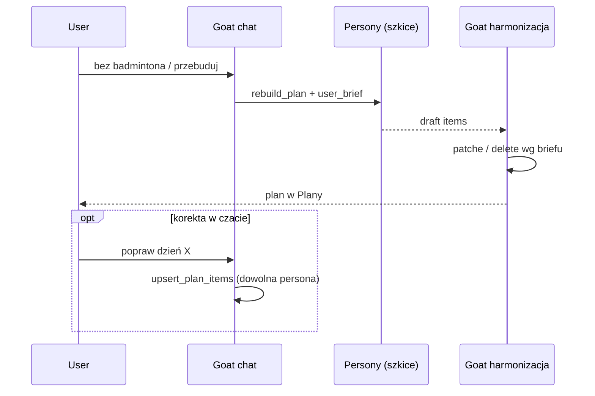

# Design: Goat — ostateczny głos nad planem (czat + harmonizacja)

**Data:** 2026-08-17  
**Status:** zaakceptowane / wdrożone (2026-08-17)  
**Powiązane:** [ADR-17](../../adr/decisions.md#adr-17-kierownik-zespołu-goat--koordynacja-sesji-general), [team-lead.md](../../technical/team-lead.md), [2026-08-16-goat-consult-persona-design.md](./2026-08-16-goat-consult-persona-design.md), ADR-2 (pipeline 3-etapowy)

> **Delta:** Goat nie tylko odpala `rebuild_plan`. Ma **ostateczny głos** nad treścią planu: (1) w czacie może modyfikować pozycje dowolnej persony, (2) etap harmonizacji w Plany jest jawnie rolą Goata i respektuje `user_brief`. Persony nadal generują i mogą `upsert_plan_items`; Goat może nadpisać / wyciąć.

## Problem

User w czacie uzgadnia z Goatem twarde ograniczenia (np. zero badmintona do września). Goat obiecuje przebudowę. W zakładce Plany widać jednak, że **poszczególne persony** (w tym trener badmintona) generują własne fragmenty, a „Harmonizacja planu…” jest anonimowym krokiem — nie wygląda na decyzję Kierownika. Goat w czacie **nie ma** `upsert_plan_items`, więc nie może szybko poprawić karty bez kolejnego pełnego generate.

Feeling: „kierownik mówi, że ogarnie”, a UI pokazuje autonomiczne persony bez jego kontroli.

## Cel

| Sytuacja | Kto ma ostateczny głos |
|----------|------------------------|
| Generowanie planu (pipeline) | Persony = szkice; **Goat** = etap 3 (harmonizacja / patche / wycięcia wg briefu) |
| Czat `general` | **Goat** może czytać i **modyfikować** pozycje dowolnej aktywnej persony |
| Czat `/slug` lub sesja `persona` | Persona może `upsert_plan_items` (bez zmian); Goat nie startuje |
| Brief usera (np. bez badmintona) | `user_brief` + wykluczenie ról przed generacją **oraz** Goat w harmonizacji egzekwuje brief |

UI: w postępie joba widoczny wiersz **Goat · Kierownik Zespołu** (harmonizuje / gotowe), zamiast samej anonimowej pigułki „Harmonizacja planu…”.

## Wymagania (Given / When / Then)

### GWT-1 — Goat upsert w czacie

**Given** sesja `general`, Goat w turze, aktywne persony usera  
**When** Goat woła `upsert_plan_items` z `persona_id` (lub slug→id) aktywnej persony i poprawnymi entries  
**Then** pozycje tej persony są zapisane / nadpisane  
**And** FE pokazuje chip jak przy innych toolach planu (np. „Plany”)  
**And** opcjonalnie odpala się lekka harmonizacja dni (jak dziś po upsert trenera)

### GWT-2 — trener nadal może zapisywać

**Given** tura trenera (`/slug` lub consult backstage)  
**When** trener woła `upsert_plan_items` dla **swojego** `persona_id`  
**Then** zapis działa jak dziś (bez uprawnień do cudzych person)

### GWT-3 — harmonizacja = Goat w UI

**Given** job `plan_generate` po zakończeniu generacji wszystkich person  
**When** startuje etap 3  
**Then** UI postępu pokazuje etap Goata: etykieta `Goat · Kierownik Zespołu`, status w stylu „harmonizuje…” → „Gotowe”  
**And** copy nie sugeruje anonimowego „zarządcy” bez Kierownika

### GWT-4 — brief egzekwowany w harmonizacji

**Given** `rebuild_plan` z `user_brief` zawierającym wykluczenie badmintona (i/lub skip `badminton_coach` przed generacją)  
**When** job kończy się success/partial  
**Then** w gotowym planie **nie ma** kart badmintona na objętych dniach  
**And** jeśli szkic persony naruszył brief, patche Goata usuwają lub zastępują te pozycje

### GWT-5 — ostateczny głos bez blokady person

**Given** persona zapisała fragment, potem user prosi Goata o korektę w czacie  
**When** Goat robi `upsert_plan_items` / przebudowę z briefem  
**Then** wynik w Plany odzwierciedla decyzję Goata (nadpisanie persony)

### GWT-6 — brak regresji tooli

**Given** Goat  
**When** lista tooli  
**Then** ma: `get_plan`, `rebuild_plan`, `update_user_profile`, `consult_persona`, **`upsert_plan_items`**  
**And** nadal **nie** ma `log_result`  
**And** trener nadal **nie** ma `rebuild_plan` / `consult_persona`

## Podejście (wariant 1 — zaakceptowany)

### Chat

- Dodać `upsert_plan_items` do `TEAM_LEAD_CHAT_TOOL_NAMES` / `get_team_lead_plan_tools()`.
- Handler: Goat może wskazać **dowolne** `persona_id` z aktywnego rosteru (walidacja jak dziś `allowed_persona_ids`).
- Prompt Goata: persony mogą zapisywać szkice; **ostateczny układ** ustala Goat (`upsert` lub `rebuild_plan` + brief).
- `consult_persona` nadal rzadko (bez zmiany z 2026-08-17).

### Pipeline (bez zmiany kolejności ADR-2)

1. Coordinator skeleton (może dostać `user_brief` — już częściowo).  
2. Per-persona generate (z briefem; skip ról wykluczonych).  
3. Harmonizacja: **prompt i semantyka = Goat · Kierownik** (nie „anonimowy zarządca”); input = draft + brief; output = targeted patches (+ ewentualnie delete pustych / konfliktowych pozycji jeśli schema na to pozwala — minimalnie: patch title/rows na regenerację / rest).

### Frontend Plany

- `PlanGenerationPersonaProgress`: zamiast / obok pigułki „Harmonizacja planu…” — wiersz **Goat · Kierownik Zespołu** z fazą harmonizacji.  
- Źródło statusu: istniejący sygnał joba (gdy persony 100% i job jeszcze `running` / flaga harmonizacji) albo jawne pole w API joba jeśli potrzebne (preferuj bez migracji: heurystyka FE `personas all done && job running` → Goat harmonizuje).

### Poza zakresem (tej iteracji)

- Osobna tabela „Goat plan items” / `persona_id` systemowy w DB.  
- Wariant 2 (Goat-first skeleton jako osobny pełny pass przed personami).  
- Dezaktywacja persony badminton w profilu usera (brief + skip + harmonizacja wystarczą).

## Pliki (orientacyjnie)

| Warstwa | Pliki |
|---------|--------|
| Tools / orchestrator chat | `tools.py`, `orchestrator.py`, `team_lead.py` (prompt) |
| Plan pipeline | `plans/orchestrator.py` (`_run_harmonization` prompt + brief) |
| FE | `PlanGenerationPersonaProgress.tsx`, ewentualnie `chat-status.ts` |
| Testy | `test_chat_tools_schema.py`, testy promptu Goata, unit harmonizacji brief→exclude, FE status |
| Docs | `team-lead.md`, ADR-17 delta, `ai-pipeline.md` § plan |

## Decyzje

| Data | Decyzja | Dlaczego |
|------|---------|----------|
| 2026-08-17 | Wariant 1 (nie Goat-first / nie Goat-only writer) | Mały diff, ADR-2 zostaje, persony zostają autorami szkiców |
| 2026-08-17 | Persony **mogą** `upsert`; Goat ma **ostateczny głos** | Product: eksperci zapisują, kierownik koryguje |
| 2026-08-17 | Harmonizacja UI = Goat, nie anonim | Feeling „kierownik ogarnia” spójny z czatem |
| 2026-08-17 | Bez nowej migracji jeśli da się heurystyką FE + prompt BE | Szybkość; job personas już istnieją |

## Ryzyka

| Ryzyko | Mitygacja |
|--------|-----------|
| Badminton „błyska” w postępie zanim Goat wytnie | `user_brief` skip roli przed generate + egzekucja w harmonizacji |
| Goat upsert złej persony | Twarda walidacja `allowed_persona_ids` / roster |
| Schema patches nie umie „delete” | Patch na rest/empty + ewentualnie rozszerzenie schema o `action: delete` w tej samej iteracji jeśli test tego wymaga |
