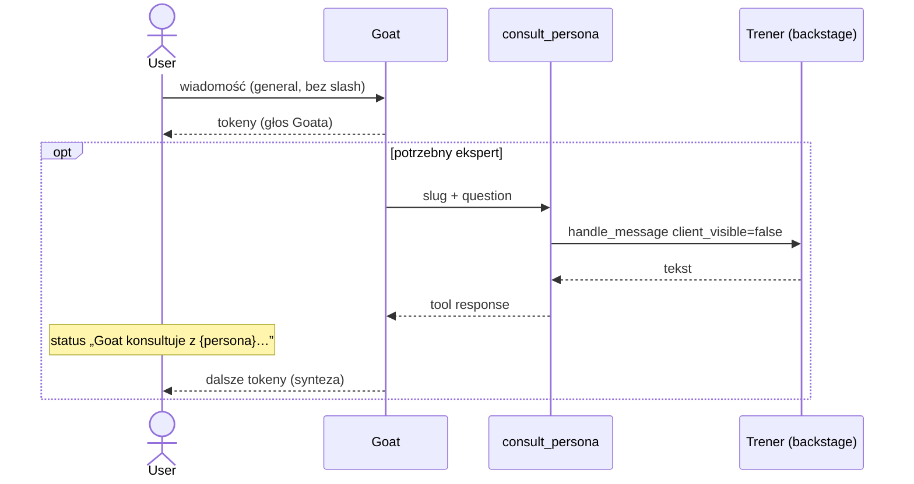

# Goat (Kierownik Zespołu) — dokumentacja techniczna

**Status:** wdrożone (2026-08-04), **nowelizacja 2026-08-16** — Goat jako jedyny głos; konsultacja przez tool `consult_persona`  
**ADR:** [ADR-17](../adr/decisions.md#adr-17-kierownik-zespołu-goat--koordynacja-sesji-general)  
**Spec:** [2026-08-16-goat-consult-persona-design.md](../superpowers/specs/2026-08-16-goat-consult-persona-design.md)

## Przegląd

**Goat** to systemowa persona koordynująca sesję **Ogólna rozmowa** (`session_type=general`). User nie konfiguruje Goata — istnieje wyłącznie w kodzie (`TeamLeadSpeaker`, prompt w `team_lead.py`).

| Tryb | Kto mówi do usera |
|------|-------------------|
| Ogólna rozmowa **bez** `/slug` | **Goat · Kierownik Zespołu** — jedyny głos; eksperta dopytuje toollem `consult_persona` |
| `/slug` lub multi-slash | **Wybrana persona** — bezpośrednio (Goat nie startuje) |
| Prośba o plan tygodnia/miesiąca | **Goat** — `rebuild_plan` w swojej turze |

Sesja w UI nadal nazywa się **Ogólna rozmowa**.

Roster `consult_persona` = **aktywne persony tego usera** (te, które utworzył), nie sztywna lista ról produktu. Własne (`custom`) też wchodzą — slug z rosteru + zakres/zachowanie w prompcie Goata.

## Przepływ tury (`general`, bez slashy)



Jedna tura SSE: `persona_turn_start` tylko dla Goata (`persona_id: null`). Zagnieżdżony trener nie emituje tokenów na kolejkę usera i nie zapisuje widocznej wiadomości `assistant` z `persona_id` trenera.

## Komponenty backend

| Plik | Odpowiedzialność |
|------|------------------|
| `backend/app/domain/chat/team_lead.py` | `TeamLeadSpeaker`, prompt tury, roster, `consult_scope_hint`, heurystyki planu/roundtable |
| `backend/app/domain/chat/orchestrator.py` | `run_chat_turn` — bez slashy tylko Goat; slash = pętla person; `_consult_persona` |
| `backend/app/domain/chat/tools.py` | `consult_persona` tylko w `get_team_lead_plan_tools()` |
| `backend/app/domain/chat/persona_scope.py` | Zakres roli `team_lead` + mapowanie typów |

### Heurystyki (wskazówki w prompcie Goata, nie wybór mówcy)

| Funkcja | Cel |
|---------|-----|
| `user_requests_plan_rebuild(message)` | Hint: wołaj `rebuild_plan` |
| `user_requests_all_trainers(message)` | Hint: skonsultuj wszystkich z rosteru |
| `consult_scope_hint(...)` | Hint slugów z **rosteru tego usera** (w tym `custom`) |

### Podział narzędzi

| Rola | Narzędzia |
|------|-----------|
| **Goat** | `get_plan`, `rebuild_plan`, `update_user_profile`, **`consult_persona`** — **bez** `log_result` / `upsert_plan_items` |
| **Trenerzy** | `log_result`, `update_user_profile`, `get_plan`, `upsert_plan_items` — **bez** `rebuild_plan` / `consult_persona` |

**Limit:** max 5 wywołań `consult_persona` na turę Goata.

### Slash (bez zmian)

`parse_multi_slash_command` → pętla person z `client_visible=True`. Goat nie startuje.

## Frontend

| Plik | Rola |
|------|------|
| `frontend/src/lib/team-lead.ts` | `TEAM_LEAD_DISPLAY_LABEL` |
| `frontend/src/lib/chat-status.ts` | chip „Konsultacja”, akcja „konsultuje” |
| `frontend/src/components/chat/ChatWindow.tsx` | Goat domyślnie; persona tylko gdy `persona_id` (slash) |
| `frontend/src/components/chat/ChatHeader.tsx` | Badge „Goat · Kierownik” |
| `frontend/src/hooks/useChatTurnRunner.ts` | `persona_turn_start` → `streaming.personaLabel` |

Wiadomości Goata w DB: `role=assistant`, `persona_id=NULL`.

## SSE (fragment)

```json
{"event": "persona_turn_start", "data": {"persona_id": null, "persona_label": "Goat · Kierownik Zespołu"}}
{"event": "persona_status", "data": {"persona_id": null, "persona_label": "Goat · Kierownik Zespołu", "phase": "tool", "message": "Goat konsultuje z Bartek · Trener motoryczny…", "tool_name": "consult_persona"}}
{"event": "tool_result", "data": {"tool_name": "consult_persona", "summary": "Skonsultowano: Bartek · Trener motoryczny", "success": true}}
```

## Sesja `persona` (1:1)

Goat **nie** uczestniczy. Trener nie ma `rebuild_plan` — pełna harmonizacja wymaga sesji `general` lub zakładki Plany.

## Powiązane

- [ai-pipeline.md](./ai-pipeline.md) §1a, §3
- [persona_scope.py](../../backend/app/domain/chat/persona_scope.py)
- Migracja `0009_persona_role_boundaries.sql` — granice ról we wszystkich template safety
