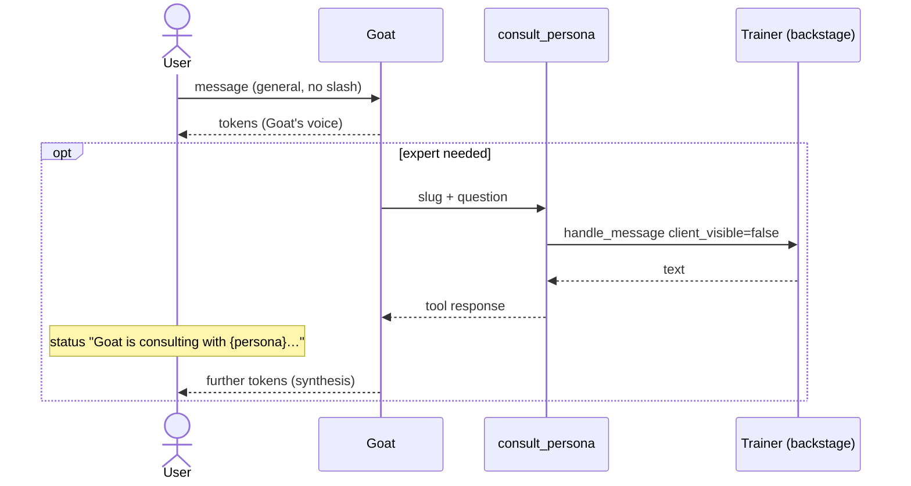

# Goat (Team Lead) — technical documentation

**Status:** implemented (2026-08-04), **amended 2026-08-16** — Goat as the only voice; consultation via the `consult_persona` tool  
**ADR:** [ADR-17](../adr/decisions.md#adr-17-kierownik-zespołu-goat--koordynacja-sesji-general)  
**Spec:** [2026-08-16-goat-consult-persona-design.md](../superpowers/specs/2026-08-16-goat-consult-persona-design.md)

## Overview

**Goat** is a system persona that coordinates the **General conversation** session (`session_type=general`). The user does not configure Goat — it exists only in code (`TeamLeadSpeaker`, prompt in `team_lead.py`).

| Mode | Who speaks to the user |
|------|------------------------|
| General conversation **without** `/slug` | **Goat · Team Lead** — the only voice; consults an expert via the `consult_persona` tool |
| `/slug` or multi-slash | **Selected persona** — directly (Goat does not start) |
| Request for a weekly/monthly plan | **Goat** — `rebuild_plan` in its turn |

The session in the UI is still called **General conversation**.

The `consult_persona` roster = **the user's active personas** (the ones they created), not a fixed list of product roles. Custom (`custom`) ones also belong — slug from the roster + scope/behavior in the Goat prompt.

## Turn flow (`general`, without slashes)



One SSE turn: `persona_turn_start` only for Goat (`persona_id: null`). A nested trainer does not emit tokens to the user queue and does not save a visible `assistant` message with the trainer's `persona_id`.

## Backend components

| File | Responsibility |
|------|----------------|
| `backend/app/domain/chat/team_lead.py` | `TeamLeadSpeaker`, turn prompt, roster, `consult_scope_hint`, plan/roundtable heuristics |
| `backend/app/domain/chat/orchestrator.py` | `run_chat_turn` — without slashes only Goat; slash = persona loop; `_consult_persona` |
| `backend/app/domain/chat/tools.py` | `consult_persona` only in `get_team_lead_plan_tools()` |
| `backend/app/domain/chat/persona_scope.py` | `team_lead` role scope + type mapping |

### Heuristics (hints in the Goat prompt, not speaker selection)

| Function | Purpose |
|----------|---------|
| `user_requests_plan_rebuild(message)` | Hint: call `rebuild_plan` |
| `user_requests_all_trainers(message)` | Hint: consult all from the roster |
| `consult_scope_hint(...)` | Hint of slugs from **this user's roster** (including `custom`) |

### Tool split

| Role | Tools |
|------|-------|
| **Goat** | `get_plan`, `rebuild_plan`, `update_user_profile`, **`consult_persona`**, **`upsert_plan_items`** (any active persona; `persona_id` required in entry), **`log_result`** (`source_persona_id=NULL`) |
| **Trainers** | `log_result`, `update_user_profile`, `get_plan`, `upsert_plan_items` (their own) — **without** `rebuild_plan` / `consult_persona` |

### Saving results via Goat (since 2026-08-17)

The user reports a workout in the `general` session to Goat, not to a trainer — so Goat saves it himself via
`log_result`, without the `consult_persona` intermediary (spec
[2026-08-17](../superpowers/specs/2026-08-17-mobile-history-and-goat-log-result-design.md)).
Previously `log_result` was blocked for him, and after the consults were limited, results were not
saved at all.

`results.source_persona_id = NULL` for Goat's entries — the team lead is not a record in `personas`
(its `id` is the sentinel `__team_lead__`), and the column has an FK to `personas(id)`. The
`_result_source_persona_id()` function in the orchestrator maps a persona to the column value;
trainers continue to save with their own UUID.

**Limit:** max 5 `consult_persona` calls per Goat turn.

**ADDED 2026-08-17 — plan latency / brief**

- Goat **by default without** `consult_persona` (handles simple answers and plan corrections himself).
- `rebuild_plan` accepts an optional `user_brief` (e.g. "no badminton") — the brief goes to the generation job; roles excluded by the brief (heuristic `plan_brief_excludes_persona_type`) do not generate entries.
- FE startup status: "Goat is preparing a response…" (not "agreeing with the team").

**ADDED 2026-08-17 — Goat's final voice over the plan**

- Personas draft; harmonization stage 3 = **Goat · Team Lead** (prompt + `user_brief` + deterministic removal of excluded roles + `update`/`delete` patches).
- In the UI for job progress: a Goat row (Pending / Harmonizing… / Done), not an anonymous pill.
- In chat, Goat can `upsert_plan_items` on any active persona — final correction without a full rebuild.

### Slash (unchanged)

`parse_multi_slash_command` → persona loop with `client_visible=True`. Goat does not start.

## Frontend

| File | Role |
|------|------|
| `frontend/src/lib/team-lead.ts` | `TEAM_LEAD_DISPLAY_LABEL` |
| `frontend/src/lib/chat-status.ts` | "Consultation" chip, "consulting" action |
| `frontend/src/components/chat/ChatWindow.tsx` | Goat by default; persona only when `persona_id` (slash) |
| `frontend/src/components/chat/ChatHeader.tsx` | "Goat · Team Lead" badge |
| `frontend/src/hooks/useChatTurnRunner.ts` | `persona_turn_start` → `streaming.personaLabel` |

Goat messages in DB: `role=assistant`, `persona_id=NULL`.

## SSE (fragment)

```json
{"event": "persona_turn_start", "data": {"persona_id": null, "persona_label": "Goat · Team Lead"}}
{"event": "persona_status", "data": {"persona_id": null, "persona_label": "Goat · Team Lead", "phase": "tool", "message": "Goat is consulting with Bartek · Motor Skills Trainer…", "tool_name": "consult_persona"}}
{"event": "tool_result", "data": {"tool_name": "consult_persona", "summary": "Consulted: Bartek · Motor Skills Trainer", "success": true}}
{"event": "consult_detail", "data": {"tool_call_id": "call-1", "slug": "motor", "persona_label": "Bartek · Motor Skills Trainer", "question": "how to improve the jump?", "answer": "Plyometrics 2x a week."}}
```

## Consultation visibility (ADDED 2026-08-22)

Spec: [2026-08-22-goat-consult-transparency-design.md](../superpowers/specs/2026-08-22-goat-consult-transparency-design.md).
The user can **peek** at Goat's question and the trainer's answer from `consult_persona` — an expandable panel (`ConsultDetails`) under the Goat message, **collapsed by default**. It does not change the "who speaks" model (ADR-17): the trainer does not have their own bubble message.

| Layer | Mechanism |
|-------|-----------|
| Backend tool response | `_consult_persona` returns JSON with `question` + `answer` (+ `persona_label`) → persisted as before in `role='tool'` |
| Backend SSE | new event `consult_detail` (payload above), emitted only on `status=ok`, alongside `tool_result`; requires `tool_call_id` passed to `_consult_persona` |
| FE live | `useChatTurnRunner` accumulates `consult_detail` per turn; on finalize attaches `consultDetails` to the Goat message in the cache (dedup by `tool_call_id`) |
| FE history | `visibleChatMessages` pairs `assistant.tool_calls` (`consult_persona`) ↔ `role='tool'` by `tool_call_id` (kept in `chat_messages.tool_calls.tool_call_id`); errors/malformed JSON are skipped |
| FE UI | `frontend/src/components/chat/ConsultDetails.tsx` — Accordion, tap target ≥ 44px, "source preview" styling |

Old history entries without `question` in JSON render with an empty question.

## Session `persona` (1:1)

Goat **does not** participate. A trainer does not have `rebuild_plan` — full harmonization requires the `general` session or the Plans tab.

## Related

- [ai-pipeline.md](./ai-pipeline.md) §1a, §3
- [persona_scope.py](../../backend/app/domain/chat/persona_scope.py)
- Migration `0009_persona_role_boundaries.sql` — role boundaries in all template safety
