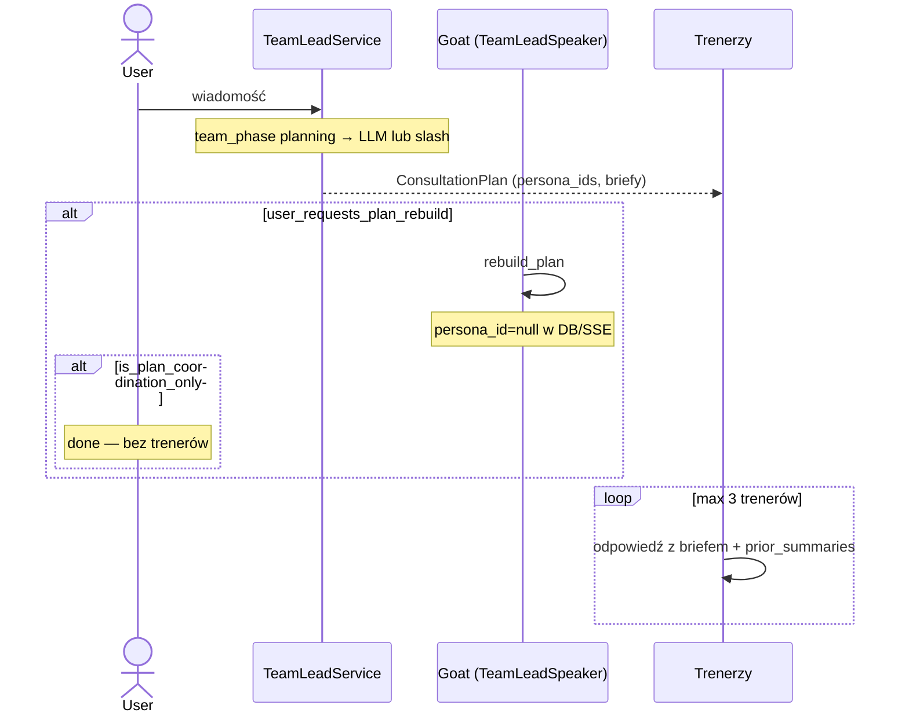

# Goat (Kierownik Zespołu) — dokumentacja techniczna

**Status:** wdrożone (2026-08-04)  
**ADR:** [ADR-17](../adr/decisions.md#adr-17-kierownik-zespołu-goat--koordynacja-sesji-general)  
**Audyt:** [2026-08-04-goat-team-lead-audit.md](./audits/2026-08-04-goat-team-lead-audit.md)

## Przegląd

**Goat** to systemowa, niewidoczna w galerii persona koordynująca sesję **Ogólna rozmowa** (`session_type=general`). User nie konfiguruje Goata — istnieje wyłącznie w kodzie (`TeamLeadService`, `TeamLeadSpeaker`).

| Tryb | Widoczność Goata |
|------|------------------|
| Zwykłe pytanie (dieta, trening, technika) | Niewidoczny — odpowiadają trenerzy |
| Prośba o plan tygodnia/miesiąca / harmonizacja | **Widoczny** jako „Goat · Kierownik Zespołu” |

Sesja w UI nadal nazywa się **Ogólna rozmowa**.

## Przepływ tury (`general`)



## Komponenty backend

| Plik | Odpowiedzialność |
|------|------------------|
| `backend/app/domain/chat/team_lead.py` | `TeamLeadService`, heurystyki planu, `TeamLeadSpeaker`, etykiety |
| `backend/app/domain/chat/orchestrator.py` | `run_chat_turn` — tura Goata przed pętlą trenerów |
| `backend/app/domain/chat/tools.py` | `get_trainer_chat_tools()` vs `get_team_lead_plan_tools()` |
| `backend/app/domain/chat/persona_scope.py` | Zakres roli `team_lead` w preambule |

### Heurystyki planu

| Funkcja | Cel |
|---------|-----|
| `user_requests_plan_rebuild(message)` | Czy wiadomość dotyczy planu (frazy: „plan na”, „zharmonizowany plan”, „przebuduj plan”…) |
| `is_plan_coordination_only(message)` | Czy user prosi **tylko** o plan — bez pytań merytorycznych (np. „co jeść”, „technika”) |

Gdy obie zwracają `True` → tura kończy się po Goacie (bez trenerów).

### Podział narzędzi

| Rola | Narzędzia |
|------|-----------|
| **Goat** | `get_plan`, `rebuild_plan` |
| **Trenerzy** | `log_result`, `update_user_profile`, `get_plan`, `upsert_plan_items` — **bez** `rebuild_plan` |

### Bypass bez LLM kierownika

Deterministycznie (bez `complete_json`):

- `/slug treść` lub multi-slash `/a /b treść`
- dokładnie **jedna** aktywna persona usera

## Frontend

| Plik | Rola |
|------|------|
| `frontend/src/lib/team-lead.ts` | `isTeamLeadAssistantMessage`, `TEAM_LEAD_DISPLAY_LABEL` |
| `frontend/src/components/chat/ChatWindow.tsx` | Nagłówek „Goat · Kierownik Zespołu” nad wiadomością |
| `frontend/src/hooks/useChatTurnRunner.ts` | `persona_turn_start` → `streaming.personaLabel` |

Wiadomości Goata w DB: `role=assistant`, `persona_id=NULL`.

## SSE (fragment)

```json
{"event": "persona_turn_start", "data": {"persona_id": null, "persona_label": "Goat · Kierownik Zespołu"}}
```

Pełny kontrakt: `docs/technical/architecture.md` §3, `docs/superpowers/specs/2026-08-04-team-lead-chat-design.md`.

## Sesja `persona` (1:1)

Goat **nie** uczestniczy. Trener nie ma `rebuild_plan` — pełna harmonizacja wymaga sesji `general` lub zakładki Plany.

## Powiązane

- [ai-pipeline.md](./ai-pipeline.md) §1a, §3
- [persona_scope.py](../../backend/app/domain/chat/persona_scope.py)
- Migracja `0009_persona_role_boundaries.sql` — granice ról we wszystkich template safety
